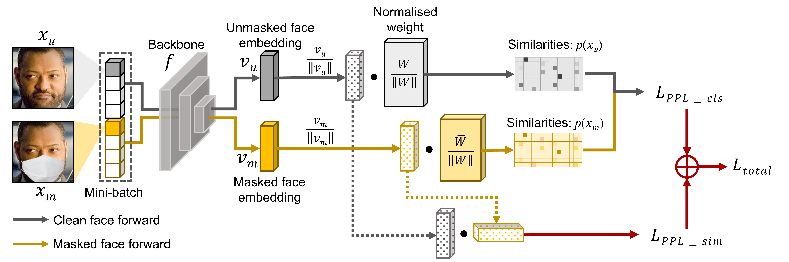

# PPL: Pairwise Prototype Learning for Masked Face Recognition

>## Abstract
The occlusion caused by a facemask emerged as a new challenge in face recognition as the pandemic of COVID-19 made wearing a facemask an everyday practice. The recognition performance of the previous approaches degraded in recognising a face with a facemask since the models were trained to extract features from the overall face and not many face samples with a facemask were available. Although the previously proposed method of using both face data without facemasks and those with synthesised facemasks for training improved the recognition performance, a certain drop in the recognition performance for faces without facemasks was observed. Thus, we propose an approach that can achieve robust recognition of faces with facemasks without compromising that of faces without facemasks. This study broke free from using a single prototype and designed Pairwise Prototype Learning (PPL) which separated the prototype depending on the facemask condition of the face data. Models trained with the proposed PPL method outperformed those trained with previously suggested methods in recognising both faces with and without facemasks. On top of presenting a new MFW+ dataset for masked face recognition benchmark, our study found a simple and intuitive way to improve recognition performance on all benchmarks, overcoming the limitation of using a single prototype in face recognition for faces with facemasks. 



```
@inproceedings{KIM_2022_BMVC,
author    = {MINSOO KIM and GIPYO NAM and Yu-Jin Hong and Ig-Jae Kim},
title     = {PPL: Pairwise Prototype Learning for Masked Face Recognition},
booktitle = {33rd British Machine Vision Conference 2022, {BMVC} 2022, London, UK, November 21-24, 2022},
publisher = {{BMVA} Press},
year      = {2022},
url       = {https://bmvc2022.mpi-inf.mpg.de/0723.pdf}
}
```

>## Usage

```python
import torch
import ireset50 from backbone
import ArcFace from losses

# Loss definition
CELoss = torch.nn.CrossEntropyLoss()

# Margin configurations
sim_margin = 1.0

# Assume training target network: backbone 'f(x)' and linear layer 'W'
f = backbone(fp16=False)
W1 = ArcFace(dim=512, m=0.5)
W2 = ArcFace(dim=512, m=0.5)

# extract feature from clean face image
clean_emb = backbone(clean_img)
# extract feature from masked face image
mask_emb = backbone(mask_img)

# Calculate new posterior probability using PPL method
clean_p = W1(clean_emb, label)
mask_p = W2(mask_emb, label)

# Calculate PPL-SIM Loss
emb_sim = torch.mm(l2_norm(clean_emb), l2_norm(mask_emb).T).diag()
sim_loss = torch.relu(sim_margin - emb_sim)
sim_loss = torch.mean(sim_loss)

# Calculate total loss
total_loss = CELoss(clean_p, label) + CELoss(mask_p, label) + sim_loss
```

>## Reference

The code for backbone network and loss can be found in the official Insightface repository. https://github.com/deepinsight/insightface
